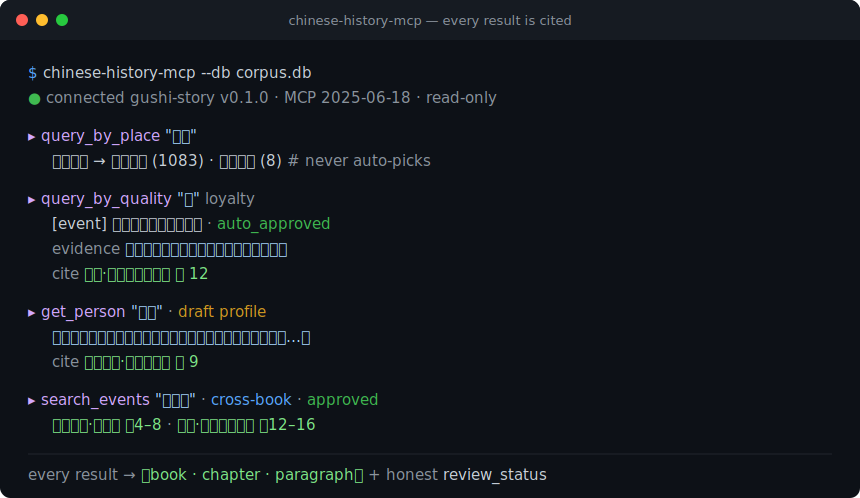

# chinese-history-mcp

[](https://github.com/lizhuojunx86/chinese-history-mcp/actions/workflows/ci.yml)
[](https://pypi.org/project/chinese-history-mcp/)
[](LICENSE)
[](DATA_LICENSE.md)
[](https://www.python.org/)
[](#)
[](https://modelcontextprotocol.io)
[](https://github.com/lizhuojunx86/chinese-history-mcp/releases)

A **traceable Chinese-history MCP server**. Four [Model Context
Protocol](https://modelcontextprotocol.io) tools over **9 classical Chinese
texts** (pre-Qin to Wei-Jin — 史记 / 汉书 / 后汉书 / 三国志 / 左传 / 论语 / 孟子 /
吕氏春秋 / 资治通鉴). **Every result carries a 【book → chapter → paragraph】
citation**, and honestly reports its `review_status` — the server never claims
per-item human review it doesn't have.

> 一个**可溯源的中国历史故事** MCP server：按事件 / 人物 / 今地名 / 品质四轴查询
> 先秦-汉魏九部正史子书，每条返回都带原文出处，机器生成/机审内容如实标注。



- **Zero runtime dependencies** — pure Python standard library. No `pip install`
  of a framework, no MCP SDK; the whole server is auditable in a few files.
- **Read-only** — opens the corpus with `mode=ro` + `PRAGMA query_only`; never
  writes.
- **Honest by construction** — machine-generated punctuation / translation and
  machine-adjudicated status are labeled in every response (AIGC-compliant).

Why this exists: as of mid-2026 the public MCP ecosystem has **no classical
Chinese / Chinese-history server**. This fills that gap. Income expectation is
zero; the goal is a useful public good.

**Contents**: [The four tools](#the-four-tools) · [Install & run](#install--run) ·
[The corpus database](#the-corpus-database) · [Honesty](#honesty-please-read) ·
[Data & provenance](#data--provenance) · [Design notes](#design-notes)

---

## The four tools

| tool | input | returns |
|---|---|---|
| `search_events` | `keyword` / `book` / `person` / `limit` | Cross-book fused historical events with **per-source provenance** (book · chapter · paragraph + role: primary/detailed/brief/comment/corroborating). `canonical_summary` is an LLM-fused machine narrative. |
| `get_person` | `name` (given name or alias) | Person profile (LLM-synthesized, `draft`) + others' appraisals (verbatim source quotes, each cited) + attributed qualities + events mentioning them. |
| `query_by_place` | `place` (today's place name) / `limit` | Ancient stories set on the land of a modern place, with citations. Same-name-different-place returns candidates for you to disambiguate — **it never silently picks one**. Directional/regional generic names are excluded. |
| `query_by_quality` | `quality` (from a 55-term controlled vocabulary, e.g. 忠 loyalty, 谋略 strategy) / `limit` / `include_draft` | Representative events and people for a quality, each with an **original-text `evidence_quote`** and rationale. |

Each tool call returns JSON. Multi-source events, person appraisals, and
place/quality edges all carry the exact 【book → chapter → paragraph】 they came
from — that is the point of the server.

---

## Install & run

Requires **Python 3.9+** (standard library only — nothing else is installed).
The server speaks MCP over stdio (newline-delimited JSON-RPC 2.0).

```bash
pip install chinese-history-mcp
# then (after downloading corpus.db from Releases — see below):
chinese-history-mcp --db /path/to/corpus.db
```

Or run without installing, straight from a checkout:

```bash
PYTHONPATH=src python3 -m storyextractor.mcp.server --db /path/to/corpus.db
```

### Configure in an MCP client

Claude Desktop (`claude_desktop_config.json`), Cline, Continue, etc. — add one
stdio server. After `pip install chinese-history-mcp`:

```json
{
  "mcpServers": {
    "chinese-history": {
      "command": "chinese-history-mcp",
      "args": ["--db", "/path/to/corpus.db"]
    }
  }
}
```

<details><summary>Alternative: run from a checkout (no install), or with <code>uvx</code></summary>

```json
{
  "mcpServers": {
    "chinese-history": {
      "command": "python3",
      "args": ["-m", "storyextractor.mcp.server", "--db", "/path/to/corpus.db"],
      "env": { "PYTHONPATH": "src" },
      "cwd": "/absolute/path/to/chinese-history-mcp"
    }
  }
}
```

Or zero-install with [uv](https://docs.astral.sh/uv/):
`uvx chinese-history-mcp --db /path/to/corpus.db`.

</details>

### Try one handshake by hand

```bash
printf '%s\n' \
  '{"jsonrpc":"2.0","id":1,"method":"initialize","params":{"protocolVersion":"2025-06-18","capabilities":{}}}' \
  '{"jsonrpc":"2.0","id":2,"method":"tools/list"}' \
  '{"jsonrpc":"2.0","id":3,"method":"tools/call","params":{"name":"query_by_quality","arguments":{"quality":"忠","limit":2}}}' \
  | chinese-history-mcp --db /path/to/corpus.db
```

### Demo + hallucination comparison

`python3 scripts/mcp_demo.py --db /path/to/corpus.db` runs a scripted tour of
all four tools (also a minimal MCP-client reference). See
[docs/MCP_DEMO.md](docs/MCP_DEMO.md) for a side-by-side of **a bare LLM
(fabricated / uncitable) vs. this server (cited)** on the same questions.

---

## The corpus database

`corpus.db` is **not** in this repository (it is a ~90 MB binary). Download it
from this repo's **[Releases](../../releases)** and point `--db` at it, or set
`STORYEXTRACTOR_DB=/path/to/corpus.db`.

The database is read-only at runtime. If you host it on a read-only medium,
make sure the release artifact was produced with
`sqlite3 corpus.db "VACUUM INTO 'corpus_release.db'"` (single file, no
`-wal`/`-shm` sidecars).

---

## Honesty (please read)

This server is designed for provenance, not to launder machine output as
scholarship. **Downstream clients and LLMs must not present its results as
"individually human-reviewed."** Every response labels what it is:

- **Events** `review_status='approved'` — mostly **machine bulk-approved**
  credible inferences, **not** per-item human review.
- **Person profiles** `review_status='draft'` — LLM-synthesized, not human-vetted.
- **Quality mappings** — `auto_approved` = multi-LLM machine consensus, `draft`
  = pending review; `evidence_quote` is a real substring of the source,
  `rationale` is an LLM's reasoning.
- **Place mappings** — mostly multi-LLM machine consensus (`auto_approved`),
  a few human-approved; confidence is bucketed high/medium/doubtful.
- **Text** — original is public-domain 白文 with **machine-generated
  punctuation/segmentation**; vernacular translation is **fully
  machine-generated**.

The server also does not eliminate downstream hallucination: it gives you
**citable retrieval facts**; an LLM built on top can still confabulate around
them. The citations are anchors for *human* verification.

Scope is the 9 texts above — "not found" means "not in this corpus," not "did
not happen."

---

## Data & provenance

- **Original text**: public-domain classical Chinese 白文 (unpunctuated base
  text from public-domain editions), with **self-produced, machine-generated
  punctuation and segmentation** (not copied from any modern annotated/collated
  edition).
- **Vernacular translation**: **machine-generated** across the whole corpus.
- **Annotations** (events / entities / places / qualities): machine-assisted,
  with human review gating on selected layers; status is reported per record.

### License

- **Code** (this repository): **MIT** — see [LICENSE](LICENSE).
- **Corpus data** (`corpus.db`, distributed via Releases): **CC BY 4.0**.

The text layer is self-produced (punctuation/segmentation) over public-domain
base text, so it is distributed freely; machine-generated attributes are
labeled throughout for AIGC compliance.

---

## Design notes

- Pure stdlib hand-written stdio JSON-RPC 2.0 (`initialize` / `tools/list` /
  `tools/call` + `ping` / notifications). No third-party MCP SDK.
- Read-only DB access (`src/storyextractor/mcp/db.py`): `mode=ro` +
  `PRAGMA query_only`; the migration-running `db.connect` is never used at
  serve time.
- Tests: `python3 tests/test_mcp_server.py` (read-only enforcement, protocol
  shapes/error codes, honest `review_status`, alias token-exact matching +
  disambiguation, LIKE-wildcard escaping) — builds a temporary fixture DB, so
  it runs without `corpus.db`.

---

## Contributing & project meta

- [CONTRIBUTING.md](CONTRIBUTING.md) — how to run tests/lint and the principles
  this project holds to.
- [CHANGELOG.md](CHANGELOG.md) — release history.
- [SECURITY.md](SECURITY.md) — threat surface (read-only, no network) and how to
  report issues.

Issues and pull requests are welcome. Please keep the constraints in mind:
zero runtime dependencies, read-only, every result cited, honest `review_status`.
